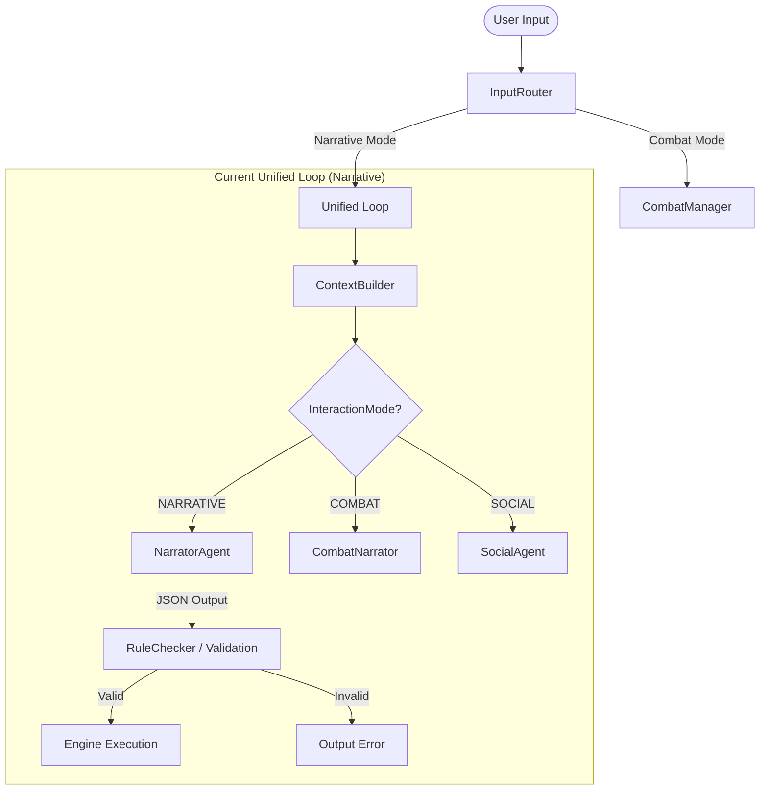
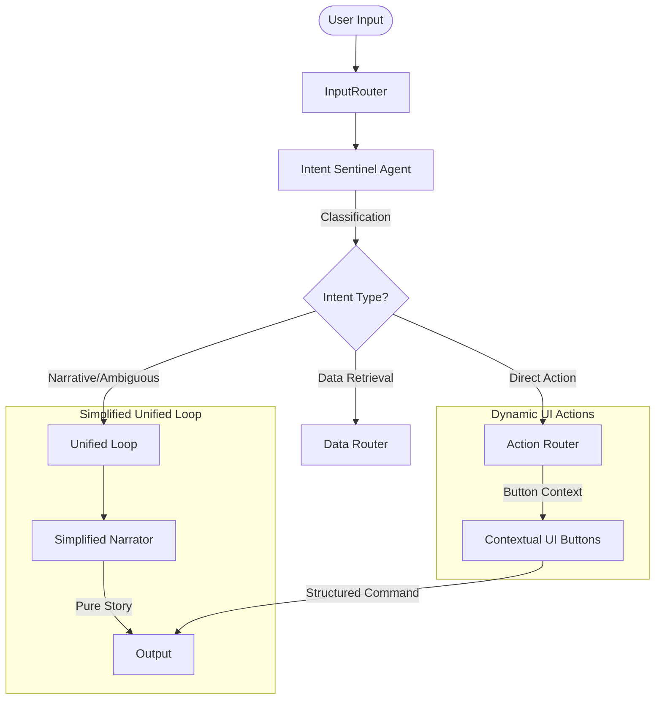

# Deep Dive Analysis: Agentic Workflow & Command Handling Optimization

## 1. Current System Analysis

### Core Problem: The Monolithic Narrator
The `NarratorAgent` (in `core/agents/narrator.py`) is currently a "God Agent". It is responsible for:
1.  **Narrative Generation**: Creating immersive story text.
2.  **Intent Extraction**: Identifying skill checks, state changes, and mode transitions from natural language.
3.  **Data Retrieval**: Handling requests for inventory, stats, etc.
4.  **World Consistency**: Maintaining lore and character continuity.

**Consequences**:
*   **Prompt Bloat**: The system prompt is extremely long and complex, leading to "context fatigue" where the LLM might ignore specific instructions or fail to output valid JSON.
*   **High Latency**: Large prompts and complex reasoning increase response time.
*   **Lower Reliability**: Small or mid-tier LLMs struggle with the high density of requirements.

### Redundancy in Commands
There is significant overlap between:
*   **RETRIEVAL (Developer) Commands**: `GET_INVENTORY`, `GET_STATS`, etc. (used for state verification).
*   **REQUEST (Narrator-driven) Commands**: `request_data_retrieval`, `request_state_change`, etc. (used by the LLM to interact with the engine).

## 2. Existing Specialized Agent Landscape
The system already employs several specialized agents, which provides a strong foundation for the Tiered Architecture:

| Agent | Responsibility | Output Format | Integration |
| :--- | :--- | :--- | :--- |
| **EntityClassifier** | Maps free-form names to enums (`actor_type`, `threat_tier`). | Strict JSON | Used for dynamic NPC creation. |
| **CombatNarrator** | Interprets combat intents and narrates attempts. | JSON (`AgentOutput`) | Active during `COMBAT` mode. |
| **SocialConflictAgent** | Manages persuasion, intimidation, and resolve. | JSON (`AgentOutput`) | Active during `SOCIAL` mode. |
| **TradeAgent** | Facilitates buying, selling, and bartering. | JSON (`AgentOutput`) | Active during `TRADE` mode. |
| **RuleChecker** | Validates loot, mechanics, and mode transitions. | XML-like tags | General validation / Anti-cheat. |
| **ContextEvaluator** | Evaluates memory and summarizes recent history. | Text Analysis | Context enrichment for other agents. |
| **ArchivistAgent** | Maintains the persistent Codex and Character Bio. | JSON / Text | Background task for world consistency. |

### The Bottleneck: Narrative Mode vs. Specialized Modes
The current system works efficiently when trapped in a specialized mode (Combat/Trade/Social). However, during **NARRATIVE (Interactive) mode**, the `NarratorAgent` is forced to act as the primary router and intent extractor for *everything else*. This makes NARRATIVE mode the least reliable part of the game.

## 3. Current Agentic Flow Analysis
Currently, player input follows two slightly different paths depending on whether the system is using the "Unified Loop" or the legacy "Agent Manager" flow.

### A. Current Logic (Simplified)

**The Problem**: The `NarratorAgent` is hit with *every* non-combat intent. It must decide if you're trying to loot, pick a lock, talk, or just look around. This overhead is what causes failures in JSON extraction or nonsensical narrative results.

---

## 4. Proposed "Intent Sentinel" Revamp
The **Intent Sentinel** will sit *above* the Unified Loop, acting as a high-speed classifier.

### B. Proposed Logic (Revamp)

### Where the Context Sentinel Fits
The **Intent Sentinel** is the "First Responder". It determines the **Interaction Mode** or **Direct Command** before the engine builds the massive context required for the Narrator.

1.  **Stage 1: Intent Identification**: Takes raw string + minimal context (Location, Mode). Returns: `Intent_Enum`.
2.  **Stage 2: Logic Branching**:
    *   If `Intent == COMBAT_INITIATE` -> Trigger Actor Extraction Agent -> Show UI.
    *   If `Intent == RETRIEVAL` -> Trigger Data Retrieval -> Show Tab.
    *   If `Intent == ROLEPLAY` -> Finally call the **NarratorAgent**.

---

## 5. Feasibility Check

### A. The "Intent Sentinel" (Intermediary Agent)
Instead of sending every input to the Narrator, introduce a lightweight **Intent Sentinel Agent**.

**Logic Flow**:
1.  **Input received** by `InputRouter`.
2.  **Sentinel Analysis**: A tiny prompt (e.g., GPT-3.5-Turbo or a fast local model) classifies the intent:
    *   `COMMAND`: Direct engine command (Save/Load/Dev).
    *   `ACTION`: Explicit gameplay action (Attack, Loot, Open).
    *   `NARRATIVE`: Story expansion or ambiguous player roleplay.
3.  **Routing**:
    *   If `COMMAND/ACTION` -> Route directly to `command_handlers.py` or a specialized handler.
    *   If `NARRATIVE` -> Route to a **simplified NarratorAgent** with 50% less prompt complexity.

### B. Agentic UI: Contextual Button Framing
Transform the static input box into a dynamic interface that "frames" possibilities.

| Feature | Implementation | Logic Source |
| :--- | :--- | :--- |
| **Start Combat** | Button | **Specialist Agent call**: "Who can I fight?" -> Returns list of [Actor_ID, Name, Relation]. UI builds a selection menu. |
| **Loot Sense** | Glowing Button | **Engine State**: If `Current_Location.loot` is not empty, button glows. Click -> `request_state_change` (inventory). |
| **Action Menu** | "Other Actions" Button | **Contextual API call**: Evaluates if `Steal`, `Barter`, or `Lockpick` are valid for current npcs/entities. |
| **Dev Commands** | Hidden Tab/Button | **Settings Check**: Only visible if `dev_mode` is enabled. |

---

## 3. Feasibility Check

| Proposal | Feasibility | Risk |
| :--- | :--- | :--- |
| **Intermediary Sentinel** | **High** | Slightly adds to per-turn total latency, though the Sentinel call should be very fast. |
| **Contextual Combat UI** | **High** | Requires a clean "Entity Extraction" agent, but this is much simpler than a full Narrator. |
| **Simplified Narrator** | **High** | Greatly improves consistency and reliability of narrative output. |
| **Glowing Loot Button** | **Very High** | Purely programmatic; no LLM needed for the "glow" itself, only for the loot's narrative context. |

---

## 4. Recommended Implementation Strategy

### Phase 1: Intent Sentinel & Simplified Narrator
1.  Create `core/agents/intent_sentinel.py`.
2.  Refactor `core/agents/narrator.py` to remove `request_data_retrieval` and complex extraction logic.
3.  Update `core/game_flow/input_router.py` to use the Sentinel before the Narrator.

### Phase 2: Dynamic Action Buttons
1.  Modify `gui/components/command_input.py` to include a row of context buttons above the text field.
2.  Implement `START COMBAT` logic:
    *   Click -> Call `AgentManager.extract_actors()`.
    *   Backend returns actor list.
    *   GUI displays a "Combat Initiation" popup with checkboxes for enemies/allies.

### Phase 3: Command Consolidation
1.  Deprecate `request_data_retrieval` in favor of specialized UI views.
2.  Mapping:
    *   Text Input -> Narrative.
    *   Button Interaction -> Structured Commands.

---

## 5. Summary Opinion
The user's vision for "restricting possibilities via framing" is the gold standard for robust AI-driven games. By moving from **"LLM as the main parser"** to **"LLM as the context provider for UI"**, we achieve:
1.  **Lower Error Rates**: The engine knows exactly what the user wants via button clicks.
2.  **Better UX**: Users don't have to guess what commands are valid.
3.  **Cost/Efficiency**: Smaller, specialized agents are cheaper and faster than one massive God Agent.

> [!IMPORTANT]
> **Next Step**: I recommend starting with the **Intent Sentinel** implementation to immediately stabilize the Narrator's behavior.
